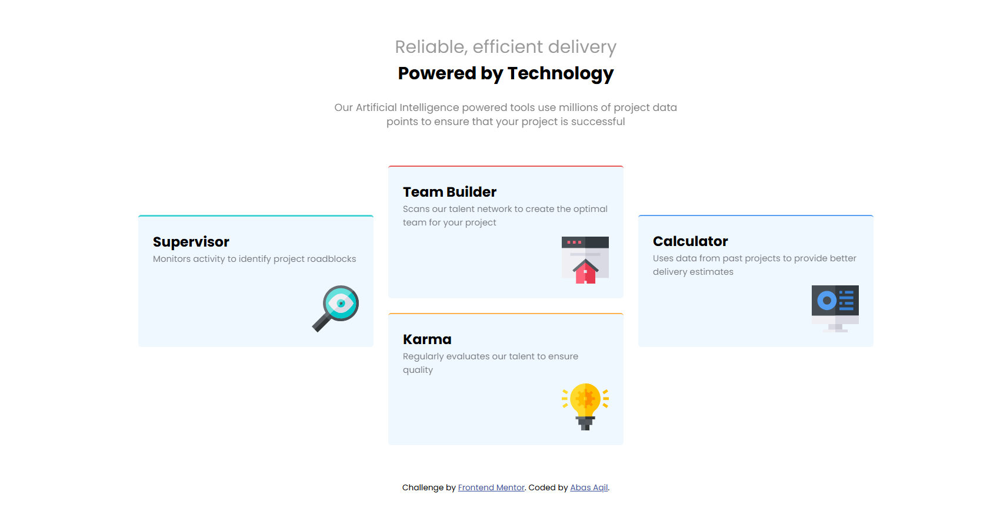

# Frontend Mentor - Four Card Feature Section

## Overview

This is my solution for the **Four Card Feature Section** challenge from Frontend Mentor.

I built the project using HTML and CSS. I used CSS Grid for the card layout and added a media query to change the layout for smaller screens.

## Built With

- HTML5
- CSS3
- CSS Grid
- Flexbox
- Media Queries

## Features

- Responsive card layout
- CSS Grid layout
- Mobile-friendly design
- Different colored borders for each card
- Responsive typography and spacing

## What I Learned

While building this project, I practiced:

- Using CSS Grid rows and columns
- Positioning cards in a grid
- Creating responsive layouts
- Using media queries
- Working with spacing, borders, and colors

## Challenges

The main challenge was getting the four cards into the correct positions using CSS Grid.

Making the cards change from the desktop layout to a single-column mobile layout also took some testing.

## Live Demo

https://abas-aqil.github.io/four-card-feature-section/

## Repository

https://github.com/Abas-Aqil/four-card-feature-section

## Frontend Mentor

Challenge:

https://www.frontendmentor.io/challenges/four-card-feature-section-weK1eFYK

## Author

**Abas Aqil**

- GitHub: https://github.com/Abas-Aqil
- Portfolio: https://abas-aqil.github.io
- Frontend Mentor: https://www.frontendmentor.io/profile/Abas-Aqil

## Acknowledgements

Thanks to Frontend Mentor for providing the challenge design and assets.
